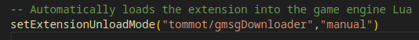

# gmsgDownloader
 Automatically downloads GMSG / Multislot if not found, just needs to be added to Plugins.

## Usage for other mods
This kind of acts like a simple version of dependency resolving and can be easily adjusted to work for other mods etc. 
### Stuff needed to change for own mods
- First choose a fitting name, for example the required-mod-ID+Downloader as "modname"
➡ Here we take gmsgDownloader as "modname" instead, from here always enter your chosen "modname"
- change foldername from /scripts/gmsgDownloader to /scripts/"modname"
- change /lua/ge/extensions/tommot/gmsgDownloader.lua to /lua/ge/extensions/"yourname"/"modname".lua
- edit /scripts/"modname"/modScript.lua so 'setExtensionUnloadMode("tommot/gmsgDownloader","manual")' reflects your name and modname
- Example script structure shown below:

- edit /lua/ge/extensions/"yourname"/"modname".lua:
find stuff to edit below "START OF ADJUSTMENTS \/ EDIT BELOW THIS LINE \/"

### TODO
- [ ] Add version check (with repo)
- [x] variables for easier config (dev) implemented
