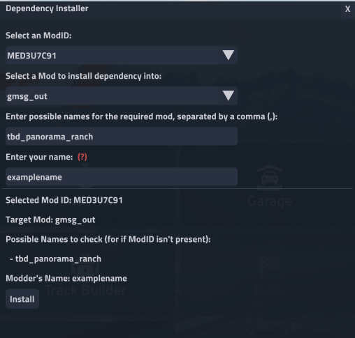
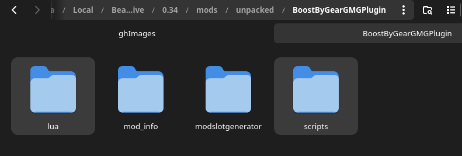
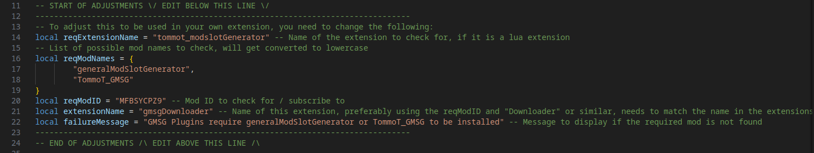

# DependNG.resolve
Automated mod-dependency resolving for BeamNG.

## More Info / detailed instructions:
[Toemmsen.ch Website](https://toemmsen.ch/posts/dependency_resolver/)

## DependNG Installer UI
This now features a DependNG installer UI for easy integration into your own mod.

To use, load it with GMSG / MultiSlot's UI in the Utils-Tab under the advanced options.
As an alternative, you can load it by entering `extensions.load("tommot_dependnginstaller")` in the game's console.

You only need this to be installed in your game for it to work (It will automatically install GMSG / MultiSlot if it isn't already, may change in the future)


A full documentation on the website is on the way.

<details>
<summary>DependNG.resolve Installer UI</summary>


</details>


### Manual Install (without the Installer UI)
- Copy the lua and script folders with its content to the root of your mod
<details>
<summary>Example how it looks in file structure</summary>


</details>

- Choose a fitting name, for example the required-mod-ID+Downloader as "modname"
➡ Here we take gmsgDownloader as "modname", from here on always enter your own chosen "modname"
- change foldername from /scripts/gmsgDownloader to /scripts/"modname"
- change /lua/ge/extensions/tommot/gmsgDownloader.lua to /lua/ge/extensions/"yourname"/"modname".lua
- edit the following line in /scripts/"modname"/modScript.lua so this reflects your name and modname 
```lua 
setExtensionUnloadMode("'yourname'_'modname'","manual")
``` 
<details>
<summary>Example for gmsgDownloader</summary>

```lua 
setExtensionUnloadMode("tommot_gmsgDownloader","manual")
``` 
</details>

- edit /lua/ge/extensions/"yourname"/"modname".lua:
find stuff to edit below 
```-- START OF ADJUSTMENTS \/ EDIT BELOW THIS LINE \/```



### TODO
<details>
<summary>Current todo list:</summary>

- [ ] Add version check (with repo)
- [x] Variables for easier config (dev) *implemented*
</details>
